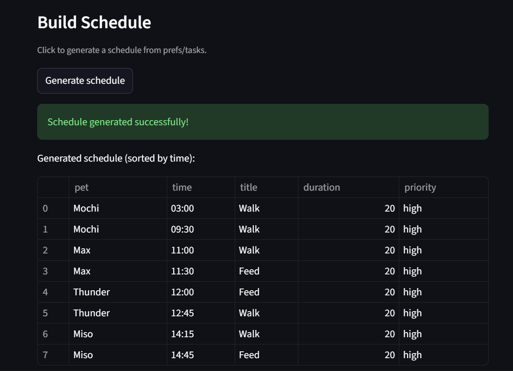

# PawPal+ (Module 2 Project)

You are building **PawPal+**, a Streamlit app that helps a pet owner plan care tasks for their pet.

## Scenario

A busy pet owner needs help staying consistent with pet care. They want an assistant that can:

- Track pet care tasks (walks, feeding, meds, enrichment, grooming, etc.)
- Consider constraints (time available, priority, owner preferences)
- Produce a daily plan and explain why it chose that plan

Your job is to design the system first (UML), then implement the logic in Python, then connect it to the Streamlit UI.

## What you will build

Your final app should:

- Let a user enter basic owner + pet info
- Let a user add/edit tasks (duration + priority at minimum)
- Generate a daily schedule/plan based on constraints and priorities
- Display the plan clearly (and ideally explain the reasoning)
- Include tests for the most important scheduling behaviors

## Getting started

### Setup

```bash
python -m venv .venv
source .venv/bin/activate  # Windows: .venv\Scripts\activate
pip install -r requirements.txt
```

### Suggested workflow

1. Read the scenario carefully and identify requirements and edge cases.
2. Draft a UML diagram (classes, attributes, methods, relationships).
3. Convert UML into Python class stubs (no logic yet).
4. Implement scheduling logic in small increments.
5. Add tests to verify key behaviors.
6. Connect your logic to the Streamlit UI in `app.py`.
7. Refine UML so it matches what you actually built.

## Smarter Scheduling

This project now includes enhanced scheduler features:

- **Recurring tasks**: `Task.mark_completed()` auto-creates a new task for `daily` or `weekly` frequency using `datetime.timedelta` (1 day / 7 days).
- **Time-based sorting**: `Scheduler.sort_by_time()` sorts `Task` entries by their `scheduled_time` in `HH:MM` format via lambda key parsing.
- **Filter API**: `Scheduler.filter_tasks()` supports filtering by completion status and pet name for flexible queries.
- **Conflict detection**: `Scheduler.detect_conflicts()` reports exact datetime-slot collisions for lightweight warnings instead of exceptions.
- **Priority-based scheduling**: `Scheduler.organize_tasks()` respects priority levels and available time constraints.

These improvements make the scheduler production-ready while keeping algorithms straightforward for MVP scenarios.

## Features

- **Pet Management**: Add and manage multiple pets per owner with basic attributes (name, species, age).
- **Task Creation**: Define pet care tasks with title, duration, priority (low/medium/high), category, and recurrence.
- **Smart Scheduling**: Generate optimized daily plans that respect owner time constraints and task priorities.
- **Time Visualization**: Tasks sorted chronologically by scheduled time for clarity.
- **Conflict Warnings**: Real-time alerts when two tasks are scheduled at the same time.
- **Recurring Tasks**: Automatically reschedule daily/weekly tasks after completion.
- **Filtering & Search**: View tasks by pet or completion status.

## Running the App

### Interactive UI (Streamlit)

```bash
streamlit run app.py
```

Open your browser to `http://localhost:8501` and start managing your pet care schedule.

### Command-line Demo

```bash
python main.py
```

### 📸 Demo 

<a href="Demo_Screenshot.png" target="_blank"></a>.


Displays a sample schedule with sorting and filtering demonstrations.

## Testing PawPal+

Run the full test suite with:

```bash
python -m pytest
```

Tests cover:

- Task status transitions (complete/incomplete)
- Sorting tasks by scheduled time
- Recurrence behavior for daily tasks (timedelta calculation)
- Conflict detection for overlapping task slots
- Pet/task data integration via Owner and Scheduler

**Confidence Level:** ★★★★☆ (4/5 stars) — key scheduling paths are validated, but edge cases (long-term plans, duration overlaps) can be further explored.


