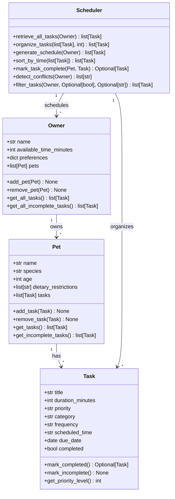

# PawPal+ Final UML Diagram

## Final Architecture (Mermaid)

```mermaid
classDiagram
    class Task {
        +str title
        +int duration_minutes
        +str priority
        +str category
        +str frequency
        +str scheduled_time
        +date due_date
        +bool completed
        +mark_completed() Optional[Task]
        +mark_incomplete() None
        +get_priority_level() int
    }
    
    class Pet {
        +str name
        +str species
        +int age
        +list[str] dietary_restrictions
        +list[Task] tasks
        +add_task(Task) None
        +remove_task(Task) None
        +get_tasks() list[Task]
        +get_incomplete_tasks() list[Task]
    }
    
    class Owner {
        +str name
        +int available_time_minutes
        +dict preferences
        +list[Pet] pets
        +add_pet(Pet) None
        +remove_pet(Pet) None
        +get_all_tasks() list[Task]
        +get_all_incomplete_tasks() list[Task]
    }
    
    class Scheduler {
        +retrieve_all_tasks(Owner) list[Task]
        +organize_tasks(list[Task], int) list[Task]
        +generate_schedule(Owner) list[Task]
        +sort_by_time(list[Task]) list[Task]
        +mark_task_complete(Pet, Task) Optional[Task]
        +detect_conflicts(Owner) list[str]
        +filter_tasks(Owner, Optional[bool], Optional[str]) list[Task]
    }
    
    Owner "1" --> "*" Pet : owns
    Pet "1" --> "*" Task : has
    Scheduler "1" --> "*" Owner : schedules
    Scheduler "1" --> "*" Task : organizes
```